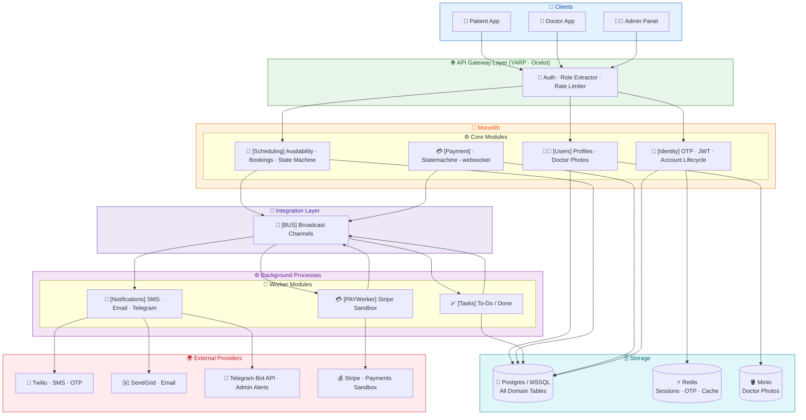

```mermaid
flowchart TB
  %% === Style Definitions ===
  classDef clients fill:#E3F2FD,stroke:#1565C0,stroke-width:1px,color:#0D47A1;
  classDef gateway fill:#E8F5E9,stroke:#2E7D32,stroke-width:1px,color:#1B5E20;
  classDef core fill:#FFF3E0,stroke:#EF6C00,stroke-width:1px,color:#E65100;
  classDef integration fill:#EDE7F6,stroke:#5E35B1,stroke-width:1px,color:#4527A0;
  classDef background fill:#F3E5F5,stroke:#8E24AA,stroke-width:1px,color:#6A1B9A;
  classDef storage fill:#E0F7FA,stroke:#00838F,stroke-width:1px,color:#006064;
  classDef external fill:#FFEBEE,stroke:#C62828,stroke-width:1px,color:#B71C1C;

  %% === Clients Layer ===
  subgraph clients["🏥 Clients"]
    PA["📱 Patient App"]
    DA["💊 Doctor App"]
    AA["🧑‍💼 Admin Panel"]
  end
  class clients clients

  %% === API Gateway Layer ===
  subgraph ApiGateway["🌐 API Gateway Layer (YARP · Ocelot)"]
    GW["🧰 Auth · Role Extractor · Rate Limiter"]
  end
  class ApiGateway gateway

  %% --- Connections (Clients → Gateway) ---
  PA --> GW
  DA --> GW
  AA --> GW

  %% === Monolith Core Layer ===
  subgraph monolith["🧩 Monolith"]
    direction TB
    subgraph core["⚙️ Core Modules"]
      AUTH["🔐 [Identity] OTP · JWT · Account Lifecycle"]
      USERS["🧑‍⚕️ [Users] Profiles · Doctor Photos"]
      SCHED["📅 [Scheduling] Availability · Bookings · State Machine"]
      PAY["💳 [Payment] · Statemachine - websocket"]
    end
  end
  class monolith core

  %% === Integration Layer ===
  subgraph integration["🔄 Integration Layer"]
    BUS["📡 [BUS] Broadcast Channels"]
  end
  class integration integration

  %% === Background Processes ===
  subgraph background["⚙️ Background Processes"]
    subgraph workers["🧠 Worker Modules"]
      TASKS["✅ [Tasks] To‑Do / Done"]
      NOTIF["📣 [Notifications] SMS · Email · Telegram"]
      PAYWorker["💳 [PAYWorker] Stripe Sandbox"]
    end
  end
  class background background

  %% --- Module Interactions ---
  SCHED --> BUS
  TASKS --> BUS
  PAYWorker --> BUS
  PAY --> BUS
  BUS --> NOTIF
  BUS --> TASKS
  BUS --> PAYWorker

  GW --> AUTH
  GW --> USERS
  GW --> SCHED

  %% === Storage Layer ===
  subgraph storage["🗄️ Storage"]
    PG[("🐘 Postgres / MSSQL<br/>All Domain Tables")]
    RD[("⚡ Redis<br/>Sessions · OTP · Cache")]
    S3[("🪣 Minio<br/>Doctor Photos")]
  end
  class storage storage

  %% --- Core to Storage ---
  AUTH --> RD
  USERS --> PG
  USERS --> S3
  SCHED --> PG
  TASKS --> PG
  PAY --> PG
  AUTH --> PG

  %% === External Providers ===
  subgraph external["🌍 External Providers"]
    TW["📨 Twilio · SMS · OTP"]
    SG["✉️ SendGrid · Email"]
    TG["🤖 Telegram Bot API · Admin Alerts"]
    ST["💰 Stripe · Payments Sandbox"]
  end
  class external external

  %% --- Integrations with Providers ---
  NOTIF --> TW
  NOTIF --> SG
  NOTIF --> TG
  PAYWorker --> ST
```
