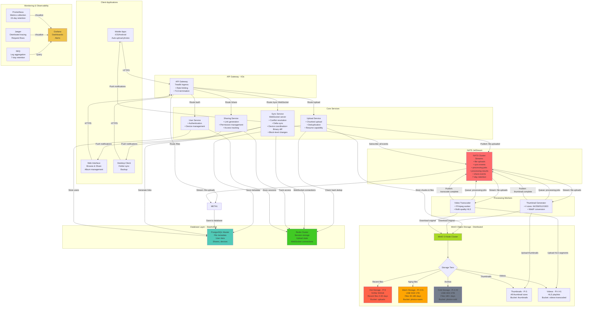

```mermaid
graph TB
    subgraph "Client Applications"
        MOBILE[Mobile Apps<br/>iOS/Android<br/>Auto-upload photos]
        WEB[Web Interface<br/>Browse & Share<br/>Album management]
        DESKTOP[Desktop Client<br/>Folder sync<br/>Backup]
    end

    subgraph "API Gateway - K3s"
        GATEWAY[API Gateway<br/>Treafik Ingress<br/>• Rate limiting<br/>• TLS termination]
    end

    subgraph "Core Services"
        UPLOAD1[Upload Service<br/>• Chunked upload<br/>• Deduplication<br/>• Resume capability]
        
        SYNC1[Sync Service<br/>WebSocket server<br/>• Conflict resolution<br/>• Delta sync<br/>• Device coordination• Binary diff<br/>• Block-level changes<br/>]
                
        SHARE[Sharing Service<br/>• Link generation<br/>• Permission management<br/>• Access tracking]
        
        USER[User Service<br/>• Authentication<br/>• Device management<br/>]
    end

    subgraph "Processing Workers"
        THUMB[Thumbnail Generator<br/>• 4 sizes: 64/256/512/1920<br/>• WebP conversion<br/>]
        
        TRANSCODE[Video Transcoder<br/>• FFmpeg worker<br/>• Multi-quality HLS<br/>]
        
    end

    subgraph "NATS JetStream"
        NATS[NATS Cluster<br/>Streams:<br/>• file-uploads<br/>• sync-events<br/>• processing-jobs<br/>• processing-results<br/>• share-events<br/>7-day retention]
    end

    subgraph "MinIO Object Storage - Distributed"
        MINIO_CLUSTER[MinIO 3-Node Cluster<br/>]
        
        STORAGE_TIERS{Storage Tiers}
        
        HOT[Hot Storage - Pi 5<br/>NVMe 500GB<br/>Recent files 0-30 days<br/>Bucket: uploads]
        
        WARM[Warm Storage - Pi 4 #1<br/>USB SSD 1TB<br/>Files 30-180 days<br/>Bucket: photos-warm]
        
        COLD[Cold Storage - Pi 4 #2<br/>USB HDD 4TB<br/>Files 180+ days<br/>Bucket: photos-cold]
        
        THUMBNAILS[Thumbnails - Pi 5<br/>All thumbnail sizes<br/>Bucket: thumbnails]
        
        TRANSCODED[Videos - Pi 4 #1<br/>HLS playlists<br/>Bucket: videos-transcoded]
    end

    subgraph "Database Layer - StatefulSet"
        
        PG_MASTER[PostgreSQL Master<br/>File metadata<br/>User data<br/>Shares, devices<br/>]
                
        REDIS_CLUSTER[Redis Cluster<br/>Session storage<br/>Upload state<br/>WebSocket connections<br/>]
    
    end


    subgraph "Monitoring & Observability"
        PROM[Prometheus<br/>Metrics collection<br/>15-day retention<br/>]
        
        GRAFANA[Grafana<br/>Dashboards<br/>Alerts<br/>]
        
        JAEGER[Jaeger<br/>Distributed tracing<br/>Request flows<br/>]
        
        SEQ[SEQ<br/>Log aggregation<br/>7-day retention<br/>]
    end

    MOBILE -->|HTTPS| GATEWAY
    WEB -->|HTTPS| GATEWAY
    DESKTOP -->|HTTPS| GATEWAY

    GATEWAY -->|Route /upload| UPLOAD1
    GATEWAY -->|Route /sync WebSocket| SYNC1
    GATEWAY -->|Route /files| META1
    GATEWAY -->|Route /share| SHARE
    GATEWAY -->|Route /auth| USER

    UPLOAD1 -->|Store chunks & files| MINIO_CLUSTER
    UPLOAD1 -->|Check hash dedup| REDIS_CLUSTER
    UPLOAD1 -->|Save metadata| PG_MASTER
    UPLOAD1 -->|Publish: file.uploaded| NATS

    SYNC1 -->|WebSocket connections| REDIS_CLUSTER
    SYNC1 -->|Subscribe: all events| NATS
    SYNC1 -->|Push notifications| MOBILE
    SYNC1 -->|Push notifications| WEB
    SYNC1 -->|Push notifications| DESKTOP

    NATS -->|Stream: file-uploads| THUMB
    NATS -->|Stream: file-uploads| TRANSCODE
    NATS -->|Stream: file-uploads| META1

    THUMB -->|Queue: processing-jobs| NATS
    THUMB -->|Download original| MINIO_CLUSTER
    THUMB -->|Upload thumbnails| THUMBNAILS
    THUMB -->|Publish: thumbnail.complete| NATS

    TRANSCODE -->|Queue: processing-jobs| NATS
    TRANSCODE -->|Download original| MINIO_CLUSTER
    TRANSCODE -->|Upload HLS segments| TRANSCODED
    TRANSCODE -->|Publish: transcode.complete| NATS

    META1 -->|Save to database| PG_MASTER

    SHARE -->|Generate links| PG_MASTER
    SHARE -->|Track access| REDIS_CLUSTER

    USER -->|Store users| PG_MASTER
    USER -->|Store sessions| REDIS_CLUSTER

    MINIO_CLUSTER --> STORAGE_TIERS
    STORAGE_TIERS -->|Recent files| HOT
    STORAGE_TIERS -->|Aging files| WARM
    STORAGE_TIERS -->|Archive| COLD
    STORAGE_TIERS -->|Thumbnails| THUMBNAILS
    STORAGE_TIERS -->|Videos| TRANSCODED

    PROM -->|Visualize| GRAFANA
    JAEGER -->|Visualize| GRAFANA
    SEQ -->|Query| GRAFANA

    style NATS fill:#ff6b6b
    style MINIO_CLUSTER fill:#aada25
    style REDIS_CLUSTER fill:#41ca24
    style PG_MASTER fill:#51cab7
    style GRAFANA fill:#eec34c
    style HOT fill:#ff6348
    style WARM fill:#ffa502
    style COLD fill:#747d8c
```
